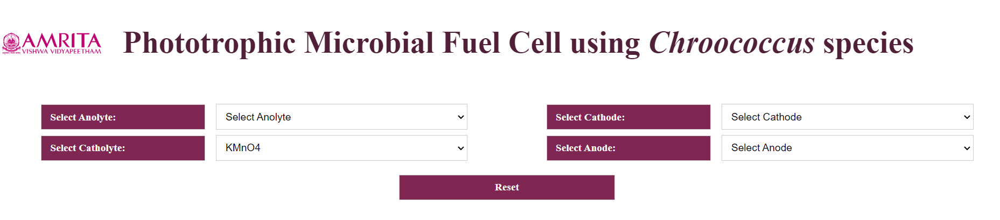
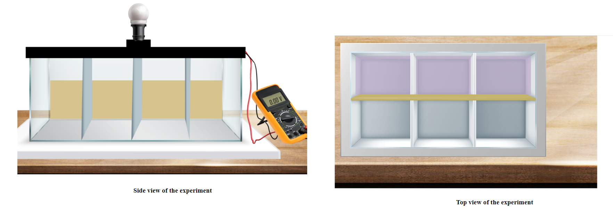
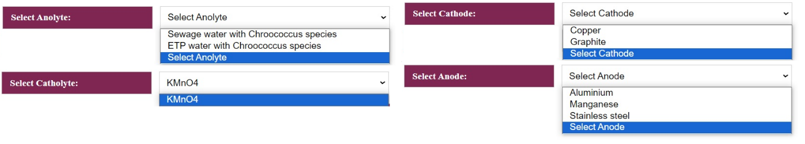
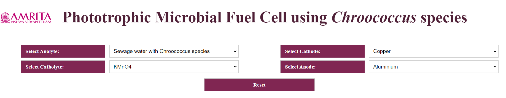
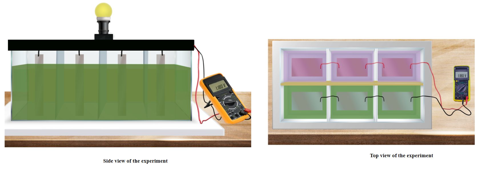
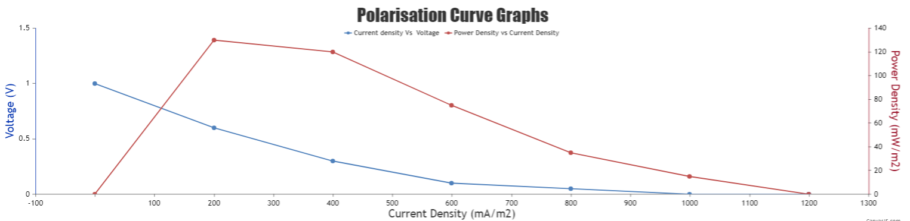
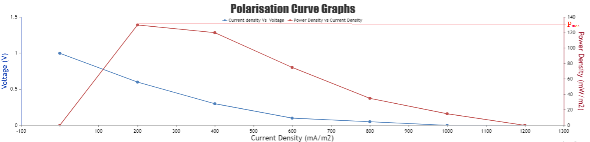
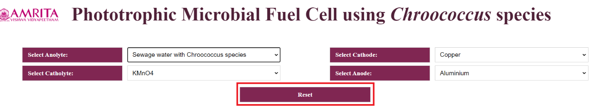
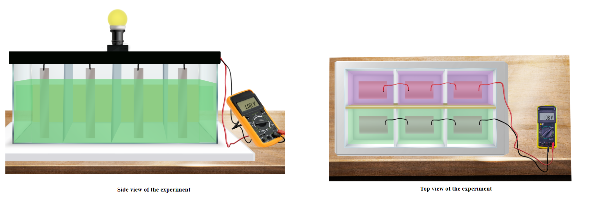
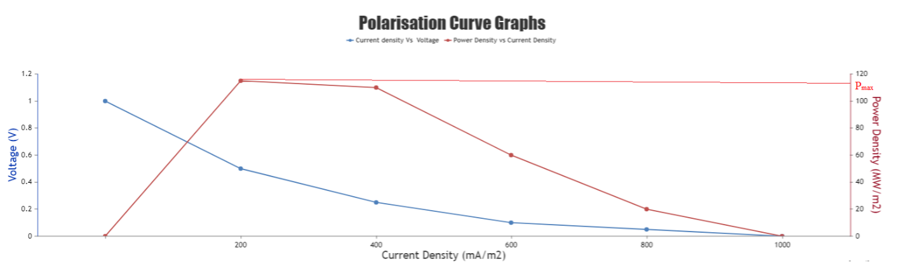

### Procedure

1.	Users can open the simulator window. The GUI has selection choices for input parameters such as Select anolyte, Select catholyte, Select cathode, Select anode, and a reset button. The experimental setup (side view and top view of the experiment) is also displayed in the GUI. In this experiment, parallel connections of MFC chambers are visualized.  MFC is connected to a voltmeter to measure the voltage and a bulb is connected to show bioelectricity production. 
 

&nbsp;
 
2.	The selection choice for Anolyte is sewage water with *Chroococcus* sp. and ETP water with *Chroococcus* sp. Catholyte is fixed as KMO4. Options for cathode are Copper and Graphite and anode options are Aluminium, Manganese, and Stainless steel. 
 

&nbsp;

3.	To work out the simulator, as an example, Anolyte is selected as Sewage water with *Chroococcus* species, Catholyte as KM04, Cathode as Copper, and Anode as Aluminium. The user can observe the MFC chamber filled with sewage water inoculated with Chrococcus species. The electrode selection can also be visible in the chamber. The side view of the experiment and the top view of the experiment are also displayed. After the selection of input parameters, users can observe the glowing of the bulb connected to the MFC representing the bioelectricity production, and can read the voltage as 1.180 V. 
Note: Aluminium and Copper are selected as electrodes as it is affordable and copper has a difference in the redox potential that favors the flow of electrons. 

&nbsp;
 
4.	The users can also see the Polarisation Curve Graph [Current density(mA/m2) versus voltage (V) and Current density versus power density (mW/m2)]  which indicates the performance of MFC in a laboratory condition displayed in the GUI. 

&nbsp;
 
From the graph, the user can find the maximum power density (Pmax) and Current density (Jmax). Here Pmax is 189.5W/m2 and Jmax is 1212mA/m2. The OCv (Open-circuit voltage) is 1.03V 

&nbsp;
 
5.	Users can click on the reset button and can then change the experiment parameters. 
 

&nbsp;

6.	Change the parameters as Anolyte is selected as ETP water with *Chroococcus* species, Catholyte as KM04, Cathode as Copper, and Anode as Aluminium. The user can observe the MFC chamber filled with ETP water inoculated with Chrococcus species. After connection, users can see the glow of the bulb connected to the MFC representing the bioelectricity production. The voltage can be read from the attached voltmeter as 1.08V
 

&nbsp;

7.	The users can also see the Polarisation Curve Graph, which indicates the performance of MFC with ETP as Anolyte.  From the graph, the user can find the maximum power density (Pmax) and Current density (Jmax). Here Pmax is 118.68W/m2 and Jmax is 1166mA/m2. The OCv (Open-circuit voltage) is 1.01V 

&nbsp;

The more biomass, the higher the power generation in the MFC system. The sewage water with phototrophs has more biomass value and it gives maximum power when compared to ETP water with phototrophic organisms. 
