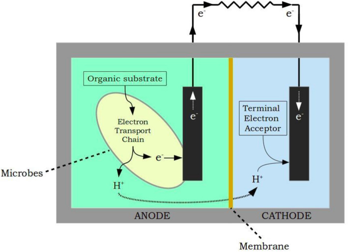
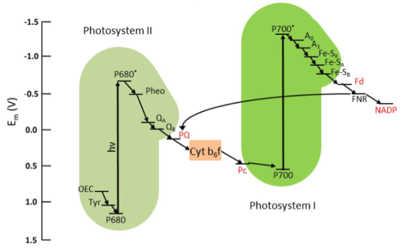
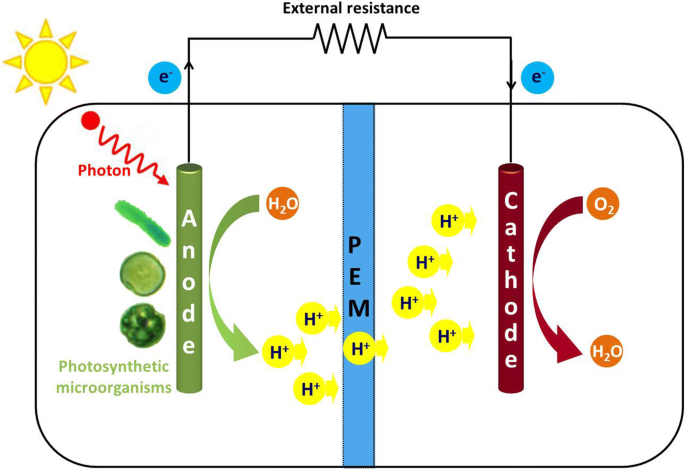

### Introduction

With the rapid growth of industrial applications, it has been reported that freshwater aquatic life has threats due to pesticide pollution, pharmaceuticals, heavy metals, and other toxic pollutants that may enter directly into natural waterways and form potential hazards to day-to-day life. The need for standard procedures for remediating pollutants and usage of green technology approaches with renewable sources including solar energy and biomass were underway to meet the necessities of humankind. Microbial fuel cells (MFCs), play an important role in bioelectricity generation with the help of electrode-adhered electrogenic bacteria that oxidize the organic substrate including wastewater to produce electrons resulting in bioelectricity generation. This technology has been considered as an environmentally friendly approach in sustainable wastewater treatment and power generation reducing the demands of costly energy resources. Nowadays, photosynthetic microbial fuel cells (photo-MFC), are a promising technology for energy production. Phototrophic MFCs (PhMFC) can be used both indoors and outdoors and use solar energy to generate power, biomass, and environmental remediation on-site. PhMFC variants include plant-based MFCs and algal-based MFCs that convert light energy into electricity through the photosynthesis process. In algal-based MFCs, a special photosynthetic process occurs at either the anode or cathode activating or replacing the role of bacteria in the regular bacterial MFCs. Plant-based MFCs are thought to be more complex due to the need for a root system near electrodes that needs to interact with bacteria adhered to the electrode to enhance photosynthesis. In this experiment, the process in an algal-based PhMFC is illustrated.

&nbsp;

### Theory

In a typical microbial fuel cell, active microorganisms are used as biocatalysts to produce bioelectricity. As discussed in the experiments link, an MFC consists of anode and cathode chambers which are separated by a proton exchange membrane (PEM). The microorganisms that act as biocatalysts in the anode oxidize the organic substrates such as glucose (electron donor) in the water that produce electrons and protons. The protons then move to the cathode through PEM and the electrons move through the external circuit. This results in the production of electric current, meanwhile the protons and electrons in the cathode chamber reduce the oxygen (electron acceptor, other examples, hexacyanoferrate, and acidic permanganate) to form water molecules (Fig.1).

&nbsp;

Fig.1. Typical configuration of a two-chambered MFC

Adapted from: Vishwanathan, A.S., 2021. Microbial fuel cells: a comprehensive review for beginners. 3 Biotech, 11(5), p.248.

Presently, different types of MFCs have been proliferated that incorporate the use of photosynthetic elements such as plants, algae, and phototrophic and heterotrophic bacteria which are termed phototrophic MFCs. In phototrophic MFCs, photosynthetic microorganisms were utilized for the conversion of light energy into electrical energy. Electroactive and photosynthetic organisms function to generate electricity and enhance MFC performance. Plant-based Phototrophic MFCs natural plant MFCs (NPMFCs), constructed wetland MFCs (CWMFCs), and marine-rooted plant MFCs (MPMFCs). Algae-based MFCs are further classified as anode algal MFCs (AAMFCs), where the photosynthesis happens at the anode produces power and in algal carbon capture cells (ACCC), algae present at the cathode chamber transform CO2 by-products from the anode into biomass with the aid of energy from absorbed photons. Plant-based MFCs are complex for laboratory settings as they involve the interaction of the root system with the anode by the symbiotic relationship between electroactive bacteria at the electrodes and plant root’s rhizodeposits. In laboratory settings, microalgae and *Cyanobacteria* were extensively used for bioenergy production and other environmental applications due to shorter cultivation time, 10-fold higher lipid content, and greater photosynthetic efficiency compared to others. Phototrophic microorganisms that could produce oxygen during photosynthesis are termed as oxygenic 
phototrophs (*Cyanobacteria*), and others were termed as anoxygenic phototrophs (e.g., green, and purple sulfur bacteria).

&nbsp;

### Working Principle of Phototropic Microbial Fuel Cell

Phototropic microbial fuel cells are devices that use photosynthetic organisms to turn light energy into electrical energy. In a PMFC, an anode accepts electrons from the microbes that grow in the anodic chamber as biofilms or as free floaters in the solution. The anode facilitates the transfer of electrons from the microorganism without any electron mediator. It is noted that the anode should not prevent light from entering through the photosynthetic cells. The cathode facilitates the reaction of protons and oxygen to form water. Apart from anaerobic bacteria that use respiratory electron transport chain together with membrane-bound cytochrome oxidases for transferring electrons to the extracellular acceptors for electricity production, phototrophic organisms including *Cyanobacteria* also possess electrogenic activity which is sunlight dependent, unlike heterotrophs. The phototrophic organism in the anode donates electrons to extracellular electron acceptors under illumination. This poses another possibility that the electron discharge may not be only the biochemical oxidation of organic compounds but also due to the light-driven bio photolysis of water.

*Cyanobacteria*, also known as blue-green algae, are photosynthetic bacteria that play a crucial role in the production of oxygen through the process of photosynthesis. *Cyanobacteria* possess an elaborate electron transport pathway for carrying out photosynthesis and respiration, and to produce energy without cellular damage. In *Cyanobacteria*, the photosynthetic electron transport chain (the light reactions) and the majority of the respiratory electron transport complexes are housed in the intricate intracytoplasmic thylakoid membranes. Conversion of solar energy in photosynthetic *Cyanobacteria* occurs over two reactions: Photosystems 1 (PS1) and Photosystems 2(PS2), densely packed with membrane-integral proteins in the thylakoid membranes. PSI functions in capturing light energy and transfers electrons to downstream components of the electron transport chain. PS1 and PS2 are connected in series that interact with electron carriers, enzymes, and co-factors including plastoquinone (PQ), Plastocyanin (PC), Cytochrome b6f complex, and ferredoxin. The electron carrier’s function is to transport electrons from water photolysis to the terminal electron acceptor Nicotinamide Adenine Dinucleotide Phosphate (NADP+). In PSI, when light energy is absorbed, the electrons become excited and move to a higher energy state. These electrons are transferred through the electron carriers, phylloquinone, and iron-sulfur clusters, and the energy is released that is used to pump protons through the thylakoid membrane into the thylakoid lumen. Ferredoxin (Fd), an iron-sulfur protein is the final electron acceptor in PSI. The electrons are transferred for the reduction of NADP⁺ to NADPH, the coenzyme in the Calvin Cycle (dark reactions) for fixing carbon dioxide to produce carbohydrates. In PSII, a chlorophyll-based molecule P680 encounters photoexcitation of redox potential from its normal state to an excited level resulting in the oxidation of water to oxygen, protons, and electrons which flow to quinone pool (QA). QA functions as an acceptor that stimulates PQ reduction. PQ accepts electrons from PSI and PSII, and transfers the electrons to Cytb6f, then to soluble electron carrier PC on the thylakoid lumen and further to PS1. In PS1, photoexcitation encountered by P700 from the normal state to excited state leading to electron flow to Fd, producing NADH (Fig.2).

&nbsp;

Fig.2. Electron Transport Chain in Plants and *Cyanobacteria*

Adapted from: Rasmussen, M. and Minteer, S.D., 2014. Photobioelectrochemistry: solar energy conversion and biofuel production with photosynthetic catalysts. Journal of the Electrochemical Society, 161(10), p.H647.

The biofilm formation and aggregation of microorganisms on surfaces is the basis for study in the development of efficient microbial fuel cells. Biofilm formation in the anode increases current formation in MFC because of the direct electron transfer between microbes and the surface of the anode.

In this experiment, *Chroococcus* species, which is a unicellular organism in the genus *Cyanobacteria*, which is blue-green in color and macroscopic colony mounded were selected as a phototrophic organism to design a phototrophic microbial fuel cell. *Chroococcus* are usually freshwater-inhabited but identified in high salinity water sources, and in plankton inhabiting water resources. *Chroococcus* cells are ovoid or rod-shaped 0.4 to 40µm sized unicells named blue-green strain of algae. Considering metabolism, *Chroococcus* are autotrophic organisms that can survive without any freshwater or oxygen source. It can produce oxygen and ATP through photosynthesis.

&nbsp;

#### Apparatus Design

The apparatus was fabricated in acrylic sheet due to its material consistency, lightweight compared to glass with flexibility and durability, and high impact resistance making it an excellent insulator. The acrylic sheet can be 30cmX20cm in length and breadth with an airtight compartment. Four square-shaped compartments with the anode (4 chambers) and cathode (4 chambers) having 5X4.5 cm2 of each compartment were modeled. The connecting salt bridge has a length of 5 centimeters and a breadth of 3 centimeters. Both anode and cathode can hold 50ml and PEM can hold 35ml. This presents a general methodology for assembling a phototrophic microbial fuel cell. The apparatus design can be changed depending on the amount of anolyte and catholyte to be filled to obtain maximum current in a scalable manner. For example, the anolyte and catholyte can be changed to 1000ml with PEM 750 ml for better results.

Generally, an MFC consists of an anodic chamber, a cathodic chamber, and a Proton Exchange Membrane (PEM) of individual cells arranged concentrically. The outer part is the anodic chamber, and the inner part is the cathodic chamber which is separated by PEM (Fig.3).

#### Electrodes

Aluminium- Copper combination

Surface area of Aluminium (anode) electrode = (4.5X4.4) = 19.8 cm2

Surface area of Copper (Cathode) electrode = (4.5X4.4) = 19.8 cm2

The surface area can be enhanced by folding the electrode sheets into four folds. Then the surface of each electrode will be 4X19.8 = 79.2 cm2

#### Proton Exchange Membrane

Nutrient agar was prepared in 675ml by adding ingredients for 750ml and properly sterilized. After cooling 75ml of Bacillus subtilis culture was added and mixed well. Seal the windows of PEM with adhesive tape and then pour nutrient agar with Bacillus culture into the middle chamber (40ml). After the agar solidified, the tape was peeled off.

#### Electrolyte

A wastewater sample was collected which was used as an anolyte. 140ml(35 ml in each compartment) was added. The sample was inoculated with the phototrophic organism, *Chroococcus* species. It was then incubated for 15 days under sunlight. Microbial growth was observed after 15 days. Aluminum electrodes were used in the anodic chamber. Potassium permanganate solution (0.3%) 140ml was prepared and 35ml was poured into a single compartment was used as catholyte. Copper electrodes were placed in the cathodic chamber. Another option for phototrophic organisms that can be added to the MFC is Synechococcus elongatus, a unicellular, obligate photoautotroph that is represented as a preeminent model for studying photosynthesis in laboratory conditions.

&nbsp;

Fig.3. Design of Phototrophic Microbial Fuel Cell in a laboratory setting

Adapted from: Cao, Y., Mu, H., Liu, W., Zhang, R., Guo, J., Xian, M. and Liu, H., 2019. Electricigens in the anode of microbial fuel cells: pure cultures versus mixed communities. Microbial cell factories, 18(1), pp.1-14.

&nbsp;

#### Biological Oxygen Demand

Biological Oxygen Demand (BOD) defines the amount of dissolved oxygen used by the microorganisms while metabolizing organic matter in the water. The water sample is diluted to ensure the demand for oxygen does not exceed the amount of available oxygen (Measuring of BOD see experiment link).

&nbsp;

#### Generation of I-V Curve

In a phototrophic Microbial Fuel Cell, the objective is to maximize power output with the highest current density with maximum potential. Open Circuit Voltage (OCV) is achieved when there is infinite resistance. The Keithley Source meter was connected to the PMFC, and the voltage sweep was calculated. The data can be used to calculate voltage versus current to obtain an IV curve. The connection can be done either in parallel or in series to study voltage and current fluctuations. Current density was calculated as I = V/A, where V (mV) is the voltage and A (m2) is the geometric surface area of the anode electrode. Power density (mW/m2) was calculated as P = IV.

In a power density graph, maximum points indicate the maximum power on the curve. The slope of the polarization curve indicates the internal resistance of MFC that has an impact on the maximum output of power generated. The point of intersection of the two-polarization graph is indicative of Maximum Power Point, which is representative of the maximum power generated by the MFC.

&nbsp;

#### Applications of Phototrophic Microbial Fuel Cell

· Wastewater treatment to produce energy utilizing anaerobic digestion.

· Hydrogen gas production. Protons and electrons produced by the organism in the anodic chamber are turned into hydrogen gas.

· BOD Sensing is used as a sensor for pollutant analysis in industrial applications.

· Production of bioelectricity.

· Bioremediation of pollutants.